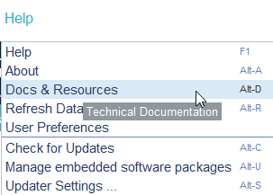
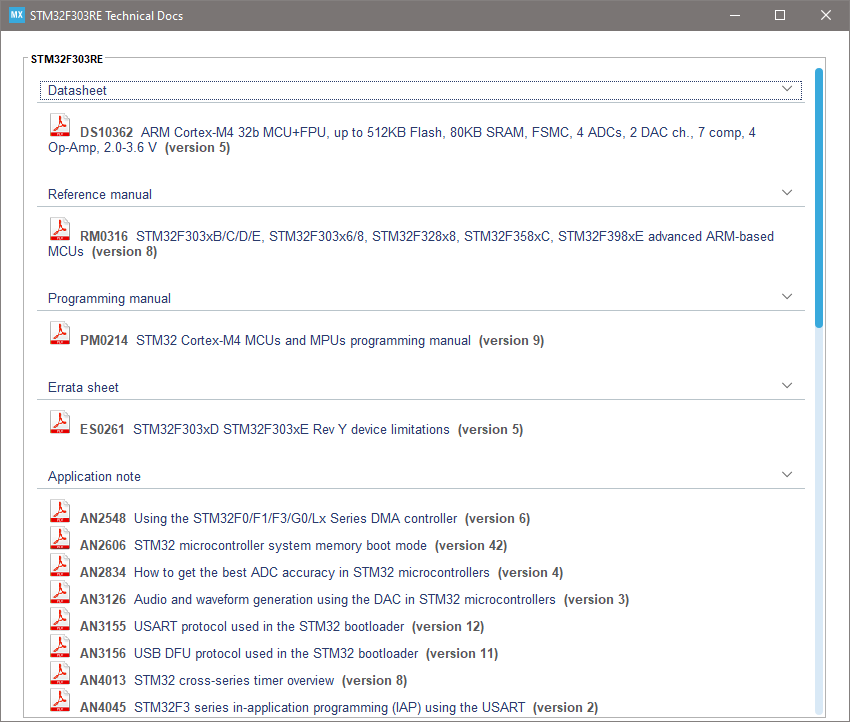
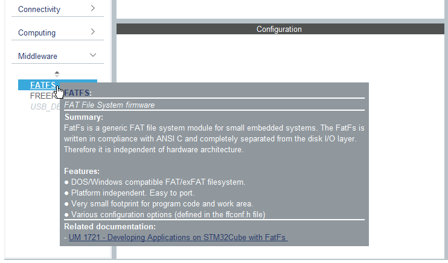

# STM32 Tutorial 000 - Intro

Embedded Software Programming on the STM32 Plattform

---

## Getting Started

In this first chapter I will give a brief introduction on how to get started with programming STM32 microcontrollers.
I will point out sources of information and I will show how to use this information for your daily programming work.

---

### IDE

The following document gives an overview on the available IDEs and tools. 
In my tutorials I am going to use Keil µVision 5 and STM32CubeMX IDE.

- Getting started with STM32 Nucleo board software  development tools (User Manual) [UM1727](https://www.st.com/content/ccc/resource/technical/document/user_manual/1b/03/1b/b4/88/20/4e/cd/DM00105928.pdf/files/DM00105928.pdf/jcr:content/translations/en.DM00105928.pdf)

#### STM32CubeMX Initialization Code Generator

- **[STM32CubeMX Download](https://www.st.com/en/development-tools/stm32cubemx.html)**
- User Manual STM32CubeMX for STM32 configuration and initialization C code generation **[UM1718](https://www.st.com/content/ccc/resource/technical/document/user_manual/10/c5/1a/43/3a/70/43/7d/DM00104712.pdf/files/DM00104712.pdf/jcr:content/translations/en.DM00104712.pdf)** (pdf)

#### STM32CubeMX IDE

Uses the open source `gcc-arm-none-eabi` compiler. Has the above STM32CubeMX graphical user interface integrated.

- **[STM32CubeMX IDE Download](https://www.st.com/en/development-tools/stm32cubemx.html#overview)**
- (User Manual STM32CubeMX for STM32 configuration and initialization C code generation **[UM1718](https://www.st.com/content/ccc/resource/technical/document/user_manual/10/c5/1a/43/3a/70/43/7d/DM00104712.pdf/files/DM00104712.pdf/jcr:content/translations/en.DM00104712.pdf)** (pdf))

#### Keil µVision

The professional tool by ARM in eval mode with a 32kB code size limitation.
In my tutorials I will use Keil µVision 5.

- [arm Keil Downloads](https://www.keil.com/download/product/)
    + **[MDK-ARM eval](https://www.keil.com/demo/eval/arm.htm)** (Keil µVision) (registration required)

#### System Workbench for MCU by AC6 (Open Source)

Uses the open source `gcc-arm-none-eabi` compiler. (I heard that it is soon to be outdated or does not support newer MCUs anymore.)

- STMicroelectronics [AC6](https://www.st.com/content/st_com/en/partner/partner-program/partnerpage/AC6.html)
    + [ac6-tools](https://www.ac6-tools.com/content.php/content_SW4MCU/lang_en_GB.xphp)
    + openstm32.org **[Download](https://www.openstm32.org/System%2BWorkbench%2Bfor%2BSTM32)** (registration required)

---

### Hardware Documentation (Datasheets / User Manuals)

For the basic introduction I will use the STM32F103 Nucleo board and link to the files related to this board.

#### STM32CubeMX Documents

The STM32CubeMX Software has all the Application Notes and User Manuals related to the current MCU available for download through the help menu.

Some peripheral drivers or software libraries may have the documentation also in the configuration menu.

#### ARM

Here you will find more generic documentation about the ARM Cortex&trade;-M Core.

- [Keil Product Manuals](http://www.keil.com/support/man_arm.htm)
    + **[Getting started with MDK](https://armkeil.blob.core.windows.net/product/gs_MDK5_4_en.pdf)** (pdf)
    + [µVision User's Guide](http://www.keil.com/support/man/docs/uv4/)

It is an engineers job to be able to read manufacturer documentation. This is why I will not explain any further how to use the IDE, as the [Getting started with MDK](https://armkeil.blob.core.windows.net/product/gs_MDK5_4_en.pdf) already covers the installation process and the usage of the software.
Please note that Keil µVision uses a **Package Manager** for Hardware specific drivers and software.

- [arm Developer Documentation](https://developer.arm.com/docs)
- **[developer.arm.com](https://developer.arm.com/documentation/)** ( previously: [arm Infocenter](http://infocenter.arm.com/help/index.jsp) )

##### Architecture Overview

ARM Cortex&trade;-M stands for Microcontroller architecture. There are different profiles, hence M0, M1, M3, M4 and M7.

- Cortex&trade;-M0 [Generic User Guide](http://infocenter.arm.com/help/topic/com.arm.doc.dui0497a/DUI0497A_cortex_m0_r0p0_generic_ug.pdf) (pdf) (contains Instruction Set information)
- Cortex&trade;-M3 [Generic User Guide](http://infocenter.arm.com/help/topic/com.arm.doc.dui0552a/DUI0552A_cortex_m3_dgug.pdf) (pdf) (contains Instruction Set information)
- Cortex&trade;-M4 [Generic User Guide](http://infocenter.arm.com/help/topic/com.arm.doc.dui0553b/DUI0553.pdf) (pdf) (contains Instruction Set information)
- Cortex&trade;-M7 [Generic User Guide](http://infocenter.arm.com/help/topic/com.arm.doc.dui0646a/DUI0646A_cortex_m7_dgug.pdf) (pdf) (contains Instruction Set information)

#### STMicroelectronics

##### Hardware Abstraction Layer (**HAL**) Libraries

The following documents contain the documentation for the HAL libraries provided by STMicroelectronics. 

- Description of **STM32F0** HAL and low-layer drivers **[UM1785](https://www.st.com/content/ccc/resource/technical/document/user_manual/2f/77/25/0f/5c/38/48/80/DM00122015.pdf/files/DM00122015.pdf/jcr:content/translations/en.DM00122015.pdf)** (pdf)
- Description of **STM32F1** HAL and low-layer drivers **[UM1850](https://www.st.com/content/ccc/resource/technical/document/user_manual/72/52/cc/53/05/e3/4c/98/DM00154093.pdf/files/DM00154093.pdf/jcr:content/translations/en.DM00154093.pdf)** (pdf)
- Description of **STM32F2** HAL and low-layer drivers **[UM1940](https://www.st.com/content/ccc/resource/technical/document/user_manual/56/32/53/cb/69/86/49/0e/DM00223149.pdf/files/DM00223149.pdf/jcr:content/translations/en.DM00223149.pdf)** (pdf)
- Description of **STM32F3** HAL and low-layer drivers **[UM1786](https://www.st.com/content/ccc/resource/technical/document/user_manual/a6/79/73/ae/6e/1c/44/14/DM00122016.pdf/files/DM00122016.pdf/jcr:content/translations/en.DM00122016.pdf)** (pdf)
- Description of **STM32F4** HAL and low-layer drivers **[UM1725](https://www.st.com/content/ccc/resource/technical/document/user_manual/2f/71/ba/b8/75/54/47/cf/DM00105879.pdf/files/DM00105879.pdf/jcr:content/translations/en.DM00105879.pdf)** (pdf)
- Description of **STM32L4** HAL and low-layer drivers **[UM1884](https://www.st.com/content/ccc/resource/technical/document/user_manual/63/a8/8f/e3/ca/a1/4c/84/DM00173145.pdf/files/DM00173145.pdf/jcr:content/translations/en.DM00173145.pdf)** (pdf)
- Description of **STM32F7** HAL and low-layer drivers **[UM1905](https://www.st.com/content/ccc/resource/technical/document/user_manual/45/27/9c/32/76/57/48/b9/DM00189702.pdf/files/DM00189702.pdf/jcr:content/translations/en.DM00189702.pdf)** (pdf)
- Description of **STM32H7** HAL and low-layer drivers **[UM2217](https://www.st.com/content/ccc/resource/technical/document/user_manual/group0/40/ee/88/53/f6/1e/4c/87/DM00392525/files/DM00392525.pdf/jcr:content/translations/en.DM00392525.pdf)** (pdf)

##### STM32 Evaluation Boards

These files are a good reference if you want to design custom PCB projects which encorporate an STM32 MCU. The documentation contains schematics to the Nucleo boards. 

**STM32 Nucleo Boards**

(Nucleo-64/144 = pin count on the MCU e.g. LQFP64)

- STM32 Nucleo-32 boards User Manual **[UM1956](https://www.st.com/content/ccc/resource/technical/document/user_manual/e3/0e/88/05/e8/74/43/a0/DM00231744.pdf/files/DM00231744.pdf/jcr:content/translations/en.DM00231744.pdf)** (pdf)
- STM32 Nucleo-64 boards User Manual **[UM1724](https://www.st.com/content/ccc/resource/technical/document/user_manual/98/2e/fa/4b/e0/82/43/b7/DM00105823.pdf/files/DM00105823.pdf/jcr:content/translations/en.DM00105823.pdf)** (pdf)
- STM32 Nucleo-64P boards User Manual **[UM2206](https://www.st.com/content/ccc/resource/technical/document/user_manual/group0/ff/5d/51/50/db/12/47/98/DM00387966/files/DM00387966.pdf/jcr:content/translations/en.DM00387966.pdf)** (pdf)
- STM32 Nucleo-144 boards User Manual **[UM1974](https://www.st.com/content/ccc/resource/technical/document/user_manual/group0/26/49/90/2e/33/0d/4a/da/DM00244518/files/DM00244518.pdf/jcr:content/translations/en.DM00244518.pdf)** (pdf)

**STM32 Discovers Boards**

Each Discovery board has its own manual. Use Google to find the appropriate "User Manual".

- Discovery kit with STM32F407VG MCU **[UM1472](https://www.st.com/content/ccc/resource/technical/document/user_manual/70/fe/4a/3f/e7/e1/4f/7d/DM00039084.pdf/files/DM00039084.pdf/jcr:content/translations/en.DM00039084.pdf)** (pdf)

#### Datasheets

Device specific. For example...

- [STM32F103RB Product Page](https://www.st.com/en/microcontrollers-microprocessors/stm32f103rb.html)
- [STM32F103c8 Datasheet](https://www.st.com/resource/en/datasheet/stm32f103c8.pdf)

---

### JTAG Debugers / Programmers

amongst others...

- STMicroelectronics [ST-Link/V2](https://www.st.com/en/development-tools/st-link-v2.html) (included on STM32-Nucleo boards) (~ $25)
- 1bitsquared [Black Magic Probe](https://github.com/blacksphere/blackmagic/wiki) ([store](https://1bitsquared.com/products/black-magic-probe)) (~ $60)
- Segger [J-Link EDU Mini](https://www.segger.com/products/debug-probes/j-link/models/j-link-edu-mini/) (~ $25)

---

**MIT License**

Copyright (c) 2020 Simon Burkhardt / simonmartin.ch / github.com/mnemocron

> Permission is hereby granted, free of charge, to any person obtaining a copy
of this software and associated documentation files (the "Software"), to deal
in the Software without restriction, including without limitation the rights
to use, copy, modify, merge, publish, distribute, sublicense, and/or sell
copies of the Software, and to permit persons to whom the Software is
furnished to do so, subject to the following conditions:

> The above copyright notice and this permission notice shall be included in all
copies or substantial portions of the Software.

> THE SOFTWARE IS PROVIDED "AS IS", WITHOUT WARRANTY OF ANY KIND, EXPRESS OR
IMPLIED, INCLUDING BUT NOT LIMITED TO THE WARRANTIES OF MERCHANTABILITY,
FITNESS FOR A PARTICULAR PURPOSE AND NONINFRINGEMENT. IN NO EVENT SHALL THE
AUTHORS OR COPYRIGHT HOLDERS BE LIABLE FOR ANY CLAIM, DAMAGES OR OTHER
LIABILITY, WHETHER IN AN ACTION OF CONTRACT, TORT OR OTHERWISE, ARISING FROM,
OUT OF OR IN CONNECTION WITH THE SOFTWARE OR THE USE OR OTHER DEALINGS IN THE
SOFTWARE.

